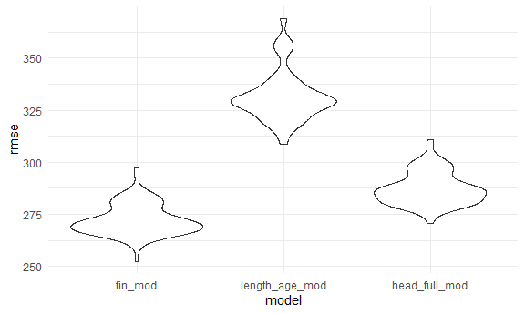

HW 6
================

``` r
library(tidyverse)
```

    ## ── Attaching core tidyverse packages ──────────────────────── tidyverse 2.0.0 ──
    ## ✔ dplyr     1.1.4     ✔ readr     2.1.5
    ## ✔ forcats   1.0.0     ✔ stringr   1.5.1
    ## ✔ ggplot2   3.5.1     ✔ tibble    3.2.1
    ## ✔ lubridate 1.9.3     ✔ tidyr     1.3.1
    ## ✔ purrr     1.0.2     
    ## ── Conflicts ────────────────────────────────────────── tidyverse_conflicts() ──
    ## ✖ dplyr::filter() masks stats::filter()
    ## ✖ dplyr::lag()    masks stats::lag()
    ## ℹ Use the conflicted package (<http://conflicted.r-lib.org/>) to force all conflicts to become errors

``` r
knitr::opts_chunk$set(
  fig.width = 6,
  fig.asp = .6,
  out.width = "90%"
)

theme_set(theme_minimal() + theme(legend.position = "bottom"))

options(
  ggplot2.continuous.colour = "viridis",
  ggplot2.continuous.fill = "viridis"
)

scale_colour_discrete = scale_colour_viridis_d
scale_fill_discrete = scale_fill_viridis_d
```

Load key packages

``` r
library(p8105.datasets)
library(modelr)
library(purrr)
```

## Problem 2

Creating a `city_state` variable (e.g. “Baltimore, MD”), and a binary
variable called `resolution` indicating whether the homicide is solved.
Omitting cities Dallas, TX; Phoenix, AZ; and Kansas City, MO as these
don’t report victim race. Also omiting Tulsa, AL as this is a data entry
mistake. For this problem, limiting the analysis those for whom
victim_race is white or black. Ensuring that victim_age is numeric.

``` r
homicide_df = 
  read_csv("data/homicide-data.csv", na = c("", "NA", "Unknown")) |> 
  mutate(
    city_state = str_c(city, state, sep = ", "),
    victim_age = as.numeric(victim_age),
    resolution = case_when(
      disposition == "Open/No arrest" ~ 0,
      disposition == "Closed without arrest" ~ 0,
      disposition == "Closed by arrest" ~ 1)
    ) |> 
  filter(!(city_state %in% c("Dallas, TX", "Phoenix, AZ", "Kansas City, MO", "Tulsa, AL"))) |> filter(victim_race %in% c("White", "Black"))
```

    ## Rows: 52179 Columns: 12
    ## ── Column specification ────────────────────────────────────────────────────────
    ## Delimiter: ","
    ## chr (8): uid, victim_last, victim_first, victim_race, victim_sex, city, stat...
    ## dbl (4): reported_date, victim_age, lat, lon
    ## 
    ## ℹ Use `spec()` to retrieve the full column specification for this data.
    ## ℹ Specify the column types or set `show_col_types = FALSE` to quiet this message.

For Baltimore, MD, using the `glm` function to fit a logistic regression
with resolved vs unresolved as the outcome and victim age, sex and race
as predictors. Saving the output of `glm` as an R object; applying the
`broom::tidy` to this object; and obtaining the estimate and confidence
interval of the adjusted odds ratio for solving homicides comparing male
victims to female victims keeping all other variables fixed.

``` r
balt_glm =
  homicide_df |> 
  filter(city_state == "Baltimore, MD") |> 
  glm(resolution ~ victim_age + victim_sex + victim_race, family = binomial(), data = _)

balt_glm |> 
  broom::tidy() |> 
  mutate(
    OR = exp(estimate),
    OR_CI_upper = exp(estimate + 1.96 * std.error), 
    OR_CI_lower = exp(estimate - 1.96 * std.error)
  ) |> 
  filter(term == "victim_sexMale") |> 
  knitr::kable(digits = 3)
```

| term           | estimate | std.error | statistic | p.value |    OR | OR_CI_upper | OR_CI_lower |
|:---------------|---------:|----------:|----------:|--------:|------:|------------:|------------:|
| victim_sexMale |   -0.854 |     0.138 |    -6.184 |       0 | 0.426 |       0.558 |       0.325 |

Running `glm` for each of the cities in the dataset, and extracting the
adjusted odds ratio (and CI) for solving homicides comparing male
victims to female victims. Doing this within a “tidy” pipeline, making
use of `purrr::map`, list columns, and unnesting as necessary to create
a dataframe with estimated ORs and CIs for each city.

``` r
mod_results =
  homicide_df |> 
  nest(data = -city_state) |> 
  mutate(
    mods = map(data, \(df) glm(resolution ~ victim_age + victim_sex + victim_race,
                                 family = binomial(), data = df)),
    tidy_mods = map(mods, broom::tidy)) |> 
  select(-mods, -data) |> 
  unnest(cols = tidy_mods) |> 
  mutate(
    OR = exp(estimate),
    OR_CI_upper = exp(estimate + 1.96 * std.error), 
    OR_CI_lower = exp(estimate - 1.96 * std.error)
  ) |> 
  filter(term == "victim_sexMale")

mod_results |> 
  slice(1:3)|> 
  knitr::kable(digits = 3)
```

| city_state      | term           | estimate | std.error | statistic | p.value |    OR | OR_CI_upper | OR_CI_lower |
|:----------------|:---------------|---------:|----------:|----------:|--------:|------:|------------:|------------:|
| Albuquerque, NM | victim_sexMale |    0.570 |     0.385 |     1.478 |   0.139 | 1.767 |       3.761 |       0.831 |
| Atlanta, GA     | victim_sexMale |    0.000 |     0.194 |     0.000 |   1.000 | 1.000 |       1.463 |       0.684 |
| Baltimore, MD   | victim_sexMale |   -0.854 |     0.138 |    -6.184 |   0.000 | 0.426 |       0.558 |       0.325 |

Creating a plot that shows the estimated ORs and CIs for each city.
Organizing cities according to estimated OR.

``` r
mod_results |> 
  mutate(city_state = fct_reorder(city_state, OR)) |> 
  ggplot(aes(x = city_state, y = OR)) +
  geom_point() +
  geom_errorbar(aes(ymin = OR_CI_lower, ymax = OR_CI_upper)) +
  theme(axis.text.x = element_text(angle = 90, hjust = 1))
```


This plot shows that many cities have OR’s that include 1 within the
confidence intervals, meaning that the OR estimates are not
statistically significant. Some cities, such as New York, NY, Baton
Rouge, LA, and Baltimore, MD, have OR’s less than 1 and the confidence
intervals do not include 1, meaning that the crimes with victims that
are male have smaller odds of resolution compared to that of female
victims adjusting for age and race, and that this is statistically
significant for these cities.

## Problem 3

Loading and cleaning the data for regression analysis. Converting
numeric to factor where appropriate and checking for missing data.

``` r
birthweight_df =
  read_csv("data/birthweight.csv") |> 
  janitor::clean_names() |>
  drop_na() |> 
  mutate(
    babysex = factor(case_match(babysex, 1 ~ "male", 2 ~ "female")),
    frace = factor(case_match(frace, 
                              1 ~ "white", 
                              2 ~ "black", 
                              3 ~ "asian", 
                              4 ~ "puerto rican", 
                              8 ~ "other", 
                              9 ~ "unknown")),
    malform = factor(case_match(malform, 0 ~ "absent", 1 ~ "present")),
    mrace = factor(case_match(mrace, 
                              1 ~ "white", 
                              2 ~ "black", 
                              3 ~ "asian", 
                              4 ~ "puerto rican", 
                              8 ~ "other", 
                              9 ~ "unknown"))
  )
```

    ## Rows: 4342 Columns: 20
    ## ── Column specification ────────────────────────────────────────────────────────
    ## Delimiter: ","
    ## dbl (20): babysex, bhead, blength, bwt, delwt, fincome, frace, gaweeks, malf...
    ## 
    ## ℹ Use `spec()` to retrieve the full column specification for this data.
    ## ℹ Specify the column types or set `show_col_types = FALSE` to quiet this message.

Building a linear regression model for birthweight on a data-driven
modeling-building process.

``` r
lin_mod = lm(bwt ~ ., data = birthweight_df)
fin_mod = step(lin_mod, trace = 1)
```

    ## Start:  AIC=48717.83
    ## bwt ~ babysex + bhead + blength + delwt + fincome + frace + gaweeks + 
    ##     malform + menarche + mheight + momage + mrace + parity + 
    ##     pnumlbw + pnumsga + ppbmi + ppwt + smoken + wtgain
    ## 
    ## 
    ## Step:  AIC=48717.83
    ## bwt ~ babysex + bhead + blength + delwt + fincome + frace + gaweeks + 
    ##     malform + menarche + mheight + momage + mrace + parity + 
    ##     pnumlbw + pnumsga + ppbmi + ppwt + smoken
    ## 
    ## 
    ## Step:  AIC=48717.83
    ## bwt ~ babysex + bhead + blength + delwt + fincome + frace + gaweeks + 
    ##     malform + menarche + mheight + momage + mrace + parity + 
    ##     pnumlbw + ppbmi + ppwt + smoken
    ## 
    ## 
    ## Step:  AIC=48717.83
    ## bwt ~ babysex + bhead + blength + delwt + fincome + frace + gaweeks + 
    ##     malform + menarche + mheight + momage + mrace + parity + 
    ##     ppbmi + ppwt + smoken
    ## 
    ##            Df Sum of Sq       RSS   AIC
    ## - frace     4    124365 320848704 48712
    ## - malform   1      1419 320725757 48716
    ## - ppbmi     1      6346 320730684 48716
    ## - momage    1     28661 320752999 48716
    ## - mheight   1     66886 320791224 48717
    ## - menarche  1    111679 320836018 48717
    ## - ppwt      1    131132 320855470 48718
    ## <none>                  320724338 48718
    ## - fincome   1    193454 320917792 48718
    ## - parity    1    413584 321137922 48721
    ## - mrace     3    868321 321592659 48724
    ## - babysex   1    853796 321578134 48727
    ## - gaweeks   1   4611823 325336161 48778
    ## - smoken    1   5076393 325800732 48784
    ## - delwt     1   8008891 328733230 48823
    ## - blength   1 102050296 422774634 49915
    ## - bhead     1 106535716 427260054 49961
    ## 
    ## Step:  AIC=48711.51
    ## bwt ~ babysex + bhead + blength + delwt + fincome + gaweeks + 
    ##     malform + menarche + mheight + momage + mrace + parity + 
    ##     ppbmi + ppwt + smoken
    ## 
    ##            Df Sum of Sq       RSS   AIC
    ## - malform   1      1447 320850151 48710
    ## - ppbmi     1      6975 320855679 48710
    ## - momage    1     28379 320877083 48710
    ## - mheight   1     69502 320918206 48710
    ## - menarche  1    115708 320964411 48711
    ## - ppwt      1    133961 320982665 48711
    ## <none>                  320848704 48712
    ## - fincome   1    194405 321043108 48712
    ## - parity    1    414687 321263390 48715
    ## - babysex   1    852133 321700837 48721
    ## - gaweeks   1   4625208 325473911 48772
    ## - smoken    1   5036389 325885093 48777
    ## - delwt     1   8013099 328861802 48817
    ## - mrace     3  13540415 334389119 48885
    ## - blength   1 101995688 422844392 49908
    ## - bhead     1 106662962 427511666 49956
    ## 
    ## Step:  AIC=48709.53
    ## bwt ~ babysex + bhead + blength + delwt + fincome + gaweeks + 
    ##     menarche + mheight + momage + mrace + parity + ppbmi + ppwt + 
    ##     smoken
    ## 
    ##            Df Sum of Sq       RSS   AIC
    ## - ppbmi     1      6928 320857079 48708
    ## - momage    1     28660 320878811 48708
    ## - mheight   1     69320 320919470 48708
    ## - menarche  1    116027 320966177 48709
    ## - ppwt      1    133894 320984044 48709
    ## <none>                  320850151 48710
    ## - fincome   1    193784 321043934 48710
    ## - parity    1    414482 321264633 48713
    ## - babysex   1    851279 321701430 48719
    ## - gaweeks   1   4624003 325474154 48770
    ## - smoken    1   5035195 325885346 48775
    ## - delwt     1   8029079 328879230 48815
    ## - mrace     3  13553320 334403471 48883
    ## - blength   1 102009225 422859375 49906
    ## - bhead     1 106675331 427525481 49954
    ## 
    ## Step:  AIC=48707.63
    ## bwt ~ babysex + bhead + blength + delwt + fincome + gaweeks + 
    ##     menarche + mheight + momage + mrace + parity + ppwt + smoken
    ## 
    ##            Df Sum of Sq       RSS   AIC
    ## - momage    1     29211 320886290 48706
    ## - menarche  1    117635 320974714 48707
    ## <none>                  320857079 48708
    ## - fincome   1    195199 321052278 48708
    ## - parity    1    412984 321270064 48711
    ## - babysex   1    850020 321707099 48717
    ## - mheight   1   1078673 321935752 48720
    ## - ppwt      1   2934023 323791103 48745
    ## - gaweeks   1   4621504 325478583 48768
    ## - smoken    1   5039368 325896447 48773
    ## - delwt     1   8024939 328882018 48813
    ## - mrace     3  13551444 334408523 48881
    ## - blength   1 102018559 422875638 49904
    ## - bhead     1 106821342 427678421 49953
    ## 
    ## Step:  AIC=48706.02
    ## bwt ~ babysex + bhead + blength + delwt + fincome + gaweeks + 
    ##     menarche + mheight + mrace + parity + ppwt + smoken
    ## 
    ##            Df Sum of Sq       RSS   AIC
    ## - menarche  1    100121 320986412 48705
    ## <none>                  320886290 48706
    ## - fincome   1    240800 321127090 48707
    ## - parity    1    431433 321317724 48710
    ## - babysex   1    841278 321727568 48715
    ## - mheight   1   1076739 321963029 48719
    ## - ppwt      1   2913653 323799943 48743
    ## - gaweeks   1   4676469 325562760 48767
    ## - smoken    1   5045104 325931394 48772
    ## - delwt     1   8000672 328886962 48811
    ## - mrace     3  14667730 335554021 48894
    ## - blength   1 101990556 422876847 49902
    ## - bhead     1 106864308 427750598 49952
    ## 
    ## Step:  AIC=48705.38
    ## bwt ~ babysex + bhead + blength + delwt + fincome + gaweeks + 
    ##     mheight + mrace + parity + ppwt + smoken
    ## 
    ##           Df Sum of Sq       RSS   AIC
    ## <none>                 320986412 48705
    ## - fincome  1    245637 321232048 48707
    ## - parity   1    422770 321409181 48709
    ## - babysex  1    846134 321832545 48715
    ## - mheight  1   1012240 321998651 48717
    ## - ppwt     1   2907049 323893461 48743
    ## - gaweeks  1   4662501 325648912 48766
    ## - smoken   1   5073849 326060260 48771
    ## - delwt    1   8137459 329123871 48812
    ## - mrace    3  14683609 335670021 48894
    ## - blength  1 102191779 423178191 49903
    ## - bhead    1 106779754 427766166 49950

``` r
summary(fin_mod)
```

    ## 
    ## Call:
    ## lm(formula = bwt ~ babysex + bhead + blength + delwt + fincome + 
    ##     gaweeks + mheight + mrace + parity + ppwt + smoken, data = birthweight_df)
    ## 
    ## Residuals:
    ##      Min       1Q   Median       3Q      Max 
    ## -1097.18  -185.52    -3.39   174.14  2353.44 
    ## 
    ## Coefficients:
    ##                     Estimate Std. Error t value Pr(>|t|)    
    ## (Intercept)       -6145.1507   141.9496 -43.291  < 2e-16 ***
    ## babysexmale         -28.5580     8.4549  -3.378 0.000737 ***
    ## bhead               130.7770     3.4466  37.944  < 2e-16 ***
    ## blength              74.9471     2.0190  37.120  < 2e-16 ***
    ## delwt                 4.1067     0.3921  10.475  < 2e-16 ***
    ## fincome               0.3180     0.1747   1.820 0.068844 .  
    ## gaweeks              11.5925     1.4621   7.929 2.79e-15 ***
    ## mheight               6.5940     1.7849   3.694 0.000223 ***
    ## mraceblack          -63.9057    42.3663  -1.508 0.131523    
    ## mracepuerto rican   -25.7914    45.3502  -0.569 0.569578    
    ## mracewhite           74.8868    42.3146   1.770 0.076837 .  
    ## parity               96.3047    40.3362   2.388 0.017004 *  
    ## ppwt                 -2.6756     0.4274  -6.261 4.20e-10 ***
    ## smoken               -4.8434     0.5856  -8.271  < 2e-16 ***
    ## ---
    ## Signif. codes:  0 '***' 0.001 '**' 0.01 '*' 0.05 '.' 0.1 ' ' 1
    ## 
    ## Residual standard error: 272.3 on 4328 degrees of freedom
    ## Multiple R-squared:  0.7181, Adjusted R-squared:  0.7173 
    ## F-statistic: 848.1 on 13 and 4328 DF,  p-value: < 2.2e-16

The initial linear regression model was fit with `bwt` as the dependent
variable and `.` or all other columns in the dataset as independent
variables. Then `step` function was used to perform a stepwise model
selection to refine the model. The default method, or the backward
elimination, was used.

Plotting the model residuals against fitted values

``` r
birthweight_df |> 
  add_predictions(fin_mod) |> 
  add_residuals(fin_mod) |> 
  ggplot(aes(x = pred, y = resid)) +
  geom_point(alpha = .5) +
  geom_smooth(se = FALSE) +
  labs(title = "Model Residuals Against Fitted Values",
       x = "Fitted Values",
       y = "Residuals")
```

    ## `geom_smooth()` using method = 'gam' and formula = 'y ~ s(x, bs = "cs")'


Making two models for comparison: first one using length at birth and
gestational age as predictors (main effects only), and the second one
using head circumference, length, sex, and all interactions (including
the three-way interaction) between these.

``` r
length_age_mod = lm(bwt ~ blength + gaweeks, data = birthweight_df)

summary(length_age_mod)
```

    ## 
    ## Call:
    ## lm(formula = bwt ~ blength + gaweeks, data = birthweight_df)
    ## 
    ## Residuals:
    ##     Min      1Q  Median      3Q     Max 
    ## -1709.6  -215.4   -11.4   208.2  4188.8 
    ## 
    ## Coefficients:
    ##              Estimate Std. Error t value Pr(>|t|)    
    ## (Intercept) -4347.667     97.958  -44.38   <2e-16 ***
    ## blength       128.556      1.990   64.60   <2e-16 ***
    ## gaweeks        27.047      1.718   15.74   <2e-16 ***
    ## ---
    ## Signif. codes:  0 '***' 0.001 '**' 0.01 '*' 0.05 '.' 0.1 ' ' 1
    ## 
    ## Residual standard error: 333.2 on 4339 degrees of freedom
    ## Multiple R-squared:  0.5769, Adjusted R-squared:  0.5767 
    ## F-statistic:  2958 on 2 and 4339 DF,  p-value: < 2.2e-16

``` r
head_full_mod = lm(bwt ~ bhead * blength * babysex, data = birthweight_df)

summary(head_full_mod)
```

    ## 
    ## Call:
    ## lm(formula = bwt ~ bhead * blength * babysex, data = birthweight_df)
    ## 
    ## Residuals:
    ##      Min       1Q   Median       3Q      Max 
    ## -1132.99  -190.42   -10.33   178.63  2617.96 
    ## 
    ## Coefficients:
    ##                             Estimate Std. Error t value Pr(>|t|)    
    ## (Intercept)                -801.9487  1102.3077  -0.728 0.466948    
    ## bhead                       -16.5975    34.0916  -0.487 0.626388    
    ## blength                     -21.6460    23.3720  -0.926 0.354421    
    ## babysexmale               -6374.8684  1677.7669  -3.800 0.000147 ***
    ## bhead:blength                 3.3244     0.7126   4.666 3.17e-06 ***
    ## bhead:babysexmale           198.3932    51.0917   3.883 0.000105 ***
    ## blength:babysexmale         123.7729    35.1185   3.524 0.000429 ***
    ## bhead:blength:babysexmale    -3.8781     1.0566  -3.670 0.000245 ***
    ## ---
    ## Signif. codes:  0 '***' 0.001 '**' 0.01 '*' 0.05 '.' 0.1 ' ' 1
    ## 
    ## Residual standard error: 287.7 on 4334 degrees of freedom
    ## Multiple R-squared:  0.6849, Adjusted R-squared:  0.6844 
    ## F-statistic:  1346 on 7 and 4334 DF,  p-value: < 2.2e-16

Comparing my model to two others Using `crossv_mc` and functions in
`purrr` as appropriate.

Using `crossv_mc` to create training and testing sets, then converting
to tibbles.

``` r
cv_df =
  crossv_mc(birthweight_df, 100) |> 
  mutate(
    train = map(train, as_tibble),
    test = map(test, as_tibble)
  )
```

Applying each model to the training set dataframe and evaluating all
testing dataframe using `rmse`.

``` r
cv_result =
  cv_df |> 
  mutate(
    fin_model = map(train, ~fin_mod),
    length_age_model = map(train, ~length_age_mod),
    head_full_model = map(train, ~head_full_mod),
  ) |> 
  mutate(
    rmse_fin_mod = map2_dbl(fin_model, 
                            test, \(mod, df) rmse(model = mod, data = df)),
    rmse_length_age_mod = map2_dbl(length_age_model, 
                                   test, \(mod, df) rmse(model = mod, data = df)),
    rmse_head_full_mod = map2_dbl(head_full_model, 
                                   test, \(mod, df) rmse(model = mod, data = df))
  )

cv_result |> 
  select(starts_with("rmse")) |> 
  pivot_longer(
    everything(),
    names_to = "model", 
    values_to = "rmse",
    names_prefix = "rmse_") |> 
  mutate(model = fct_inorder(model)) |> 
  ggplot(aes(x = model, y = rmse)) + 
  geom_violin()
```


